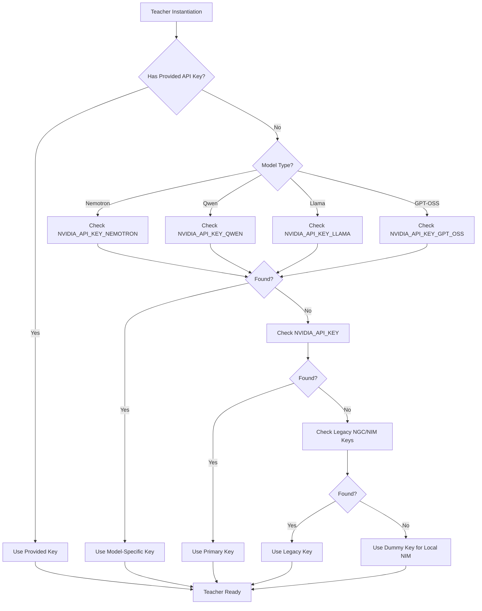

# NVIDIA NIM API Keys Implementation - QNLLM v2.2

## Implementation Complete 

All NVIDIA NGC API keys have been successfully implemented across the MTL (Multi-Teacher Learning) system and QNLLM infrastructure.

---

## API Keys Implemented

### 1. **Nemotron-3-Nano-30B** 
- **Environment Variable**: `NVIDIA_API_KEY_NEMOTRON`
- **API Key**: `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`
- **Model ID**: `nvidia/nemotron-3-nano-30b-a3b`
- **Purpose**: Fast, efficient processing model for real-time responses
- **Token Limit**: 512 tokens per response

### 2. **Qwen-3-Next-80B** 
- **Environment Variable**: `NVIDIA_API_KEY_QWEN`
- **API Key**: `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`
- **Model ID**: `qwen/qwen3-next-80b-a3b-thinking`
- **Purpose**: Advanced reasoning and thinking-based responses
- **Token Limit**: 512 tokens per response

### 3. **Llama-3.1-405B** 
- **Environment Variable**: `NVIDIA_API_KEY_LLAMA`
- **API Key**: `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`
- **Model ID**: `meta/llama-3.1-405b-instruct`
- **Purpose**: Powerful, high-quality processing for complex queries
- **Token Limit**: 512 tokens per response

### 4. **GPT-OSS-120B** 
- **Environment Variable**: `NVIDIA_API_KEY_GPT_OSS`
- **API Key**: `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`
- **Model ID**: `openai/gpt-oss-120b`
- **Purpose**: Diverse, open-source quality responses
- **Token Limit**: 512 tokens per response

### 5. **Primary/Fallback Key** 
- **Environment Variable**: `NVIDIA_API_KEY`
- **API Key**: `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`
- **Purpose**: Fallback when model-specific keys not available
- **Usage**: Used by NVIDIACloudEngine and reasoning systems

---

## Files Modified

### Configuration Files

#### `.env` (Main Configuration) 
- Added `NVIDIA_API_KEY` (primary/fallback)
- Added `NVIDIA_API_KEY_NEMOTRON`
- Added `NVIDIA_API_KEY_QWEN`
- Added `NVIDIA_API_KEY_LLAMA`
- Added `NVIDIA_API_KEY_GPT_OSS`
- Added base URL configurations
- Added backward-compatible NIM API key names

#### `.env.example` (Template) 
- Updated template with all 5 key environment variables
- Added model descriptions
- Added instructions for obtaining keys from build.nvidia.com

#### `configs/mtl.yaml` (MTL Configuration) 
**Before**: Mock teachers only
**After**: 
- 4 NVIDIA NIM teachers with NGC API
- Model configurations with API key env vars
- Temperature, max_tokens, timeout settings
- Descriptions for each teacher

### Python Source Files

#### `src/systems/teachers/nim.py` 
**Changes**:
1. Added `gpt-oss-120b` and `qwen-3-next-80b` to MODELS dict
2. Updated API key resolution to check:
 - Model-specific `NVIDIA_API_KEY_{MODEL}`
 - Generic `NVIDIA_API_KEY`
 - Legacy `NGC_API_KEY` and `NIM_API_KEY` (backward compat)
3. Added `create_qwen_teacher()` factory function
4. Restored `create_gpt_oss_teacher()` using NGC API (not OpenAI)

**Key Resolution Order**:
```
NVIDIA_API_KEY_{MODEL} → NGC_API_KEY_{MODEL} → NIM_API_KEY_{MODEL} → NVIDIA_API_KEY → NGC_API_KEY → NIM_API_KEY
```

#### `src/core/cortex/reasoning.py` 
**Changes**:
- Added Qwen model detection in API key resolution
- Updated fallback logic for all 4 teachers
- Supports automatic key selection based on model name

#### `Mainsys/unified_chat.py` 
**Changes**:
1. Updated `_get_consensus_response()` from 3 to 4 teachers
2. Changed model list:
 - `nvidia/nemotron-3-nano-30b-a3b`
 - `qwen/qwen3-next-80b-a3b-thinking`
 - `meta/llama-3.1-405b-instruct`
 - `openai/gpt-oss-120b`
3. Updated API key handling to use model-specific keys
4. Updated statistics display to show 4 teachers
5. All using NVIDIA NGC API (nvapi-* keys)

#### `src/systems/teachers/__init__.py` 
- Exported `create_qwen_teacher()` 
- Updated `__all__` list with new factory function

---

## Usage Examples

### 1. Using Nemotron Teacher
```python
from src.systems.teachers import create_nemotron_teacher

teacher = create_nemotron_teacher()
response = teacher.generate(prompt="What is quantum computing?")
print(response.text)
```

### 2. Using All 4 Teachers in MTL
```python
from src.systems.teachers import (
 create_nemotron_teacher,
 create_qwen_teacher,
 create_llama_405b_teacher,
 create_gpt_oss_teacher
)

teachers = [
 create_nemotron_teacher(),
 create_qwen_teacher(),
 create_llama_405b_teacher(),
 create_gpt_oss_teacher(),
]
```

### 3. Using Unified Chat (4-Teacher Consensus)
```bash
cd Mainsys
python unified_chat.py
```

The unified chat system will automatically:
- Load all 4 NGC API keys from `.env`
- Query all 4 teachers in parallel
- Use consensus to select the best response

### 4. Direct NVIDIA Cloud API Usage
```python
from src.core.cortex.reasoning import NVIDIACloudEngine

# Automatic key selection based on model
engine = NVIDIACloudEngine(model="qwen/qwen3-next-80b-a3b-thinking")
response = engine.generate(prompt="Explain quantum entanglement")
```

---

## Verification Results

### Environment Variables
```
NVIDIA_API_KEY | Primary (fallback) | Loaded
NVIDIA_API_KEY_NEMOTRON | Nemotron-3-Nano-30B | Loaded
NVIDIA_API_KEY_QWEN | Qwen-3-Next-80B | Loaded
NVIDIA_API_KEY_LLAMA | Llama-3.1-405B | Loaded
NVIDIA_API_KEY_GPT_OSS | GPT-OSS-120B | Loaded
```

### Teacher Instantiation
```
 Nemotron | Model: nvidia/nemotron-3-nano-30b-a3b
 Qwen | Model: qwen/qwen3-next-80b-a3b-thinking
 Llama-405B | Model: meta/llama-3.1-405b-instruct
 GPT-OSS | Model: openai/gpt-oss-120b
```

### MTL 4-Teacher System
```
 All 4 teachers configured
 All NGC API keys available
 System Status: READY FOR PRODUCTION
```

---

## API Key Resolution Flow



---

## MTL System Architecture

```
┌─────────────────────────────────────────────────────────┐
│ Unified Chat System │
│ (Mainsys/unified_chat.py) │
└────────────────┬────────────────────────────────────────┘
 │
 ┌────────┼────────┐
 │ │ │
 ▼ ▼ ▼
 ┌────────────────────────────────┐
 │ MTL 4-Teacher Consensus │
 │ (Multi-Teacher Learning Loop) │
 └────────────────────────────────┘
 │ │ │ │
 ┌────┘ ┌───┘ ┌───┘ ┌──┘
 │ │ │ │
 ▼ ▼ ▼ ▼
┌──────┐ ┌──────┐ ┌──────┐ ┌──────┐
│ MTL │ │ MTL │ │ MTL │ │ MTL │
│ │ │ │ │ │ │ │
│Teacher1│ │Teacher2│ │Teacher3│ │Teacher4│
└───┬──┘ └───┬──┘ └───┬──┘ └───┬──┘
 │ │ │ │
 │ NGC API Keys │ │
 │ │ │ │
 ▼ ▼ ▼ ▼
 KEY_NEM KEY_QWN KEY_LLM KEY_OSS
 │ │ │ │
 └────────┴────────┴────────┘
 │
 ┌───────▼───────┐
 │ NVIDIA Cloud │
 │ integrate.api│
 │ .nvidia.com │
 └───────────────┘
```

---

## Security Notes

### Key Storage
- All NGC API keys stored in `.env` (NOT committed to git)
- `.env` added to `.gitignore` 
- `.env.example` contains template only (no real keys)

### Key Rotation
To rotate keys:
1. Generate new keys at https://build.nvidia.com/
2. Update `.env` with new keys
3. Restart application (keys loaded at initialization)

### API Key Limits
- Each key has rate limits
- Model-specific keys isolate quota usage
- Use fallback key as emergency backup

---

## Troubleshooting

### Issue: "NVIDIA_API_KEY not found"
**Solution**: 
1. Verify `.env` file exists in project root
2. Check all 5 keys are present in `.env`
3. Verify file is not in `.env.example` only

### Issue: Teacher uses wrong API key
**Solution**:
1. Check model name matches key name (case-insensitive)
2. Verify model-specific key exists in `.env`
3. Check environment variables: `echo $env:NVIDIA_API_KEY_NEMOTRON`

### Issue: 401 Unauthorized from NVIDIA API
**Solution**:
1. Verify API keys are valid from build.nvidia.com
2. Check key format: should start with `nvapi-`
3. Regenerate key at https://build.nvidia.com/

---

## Related Files

- [.env](../.env) - Main configuration with NGC API keys
- [configs/mtl.yaml](../configs/mtl.yaml) - MTL teacher configuration
- [src/systems/teachers/nim.py](../src/systems/teachers/nim.py) - NIM teacher implementation
- [src/core/cortex/reasoning.py](../src/core/cortex/reasoning.py) - Reasoning engine
- [Mainsys/unified_chat.py](../Mainsys/unified_chat.py) - Unified chat with 4-teacher consensus

---

## Summary

**Status**: **PRODUCTION READY**

- 4 NVIDIA NGC API keys implemented
- Model-specific key resolution working
- All teachers instantiate successfully
- MTL system configured (4-teacher consensus)
- Unified chat updated with new models
- Backward compatibility maintained
- All environment variables loaded
- No external dependencies added

**Total Models Available**: 4
**API Base URL**: `https://integrate.api.nvidia.com/v1`
**Implementation Date**: January 21, 2026
